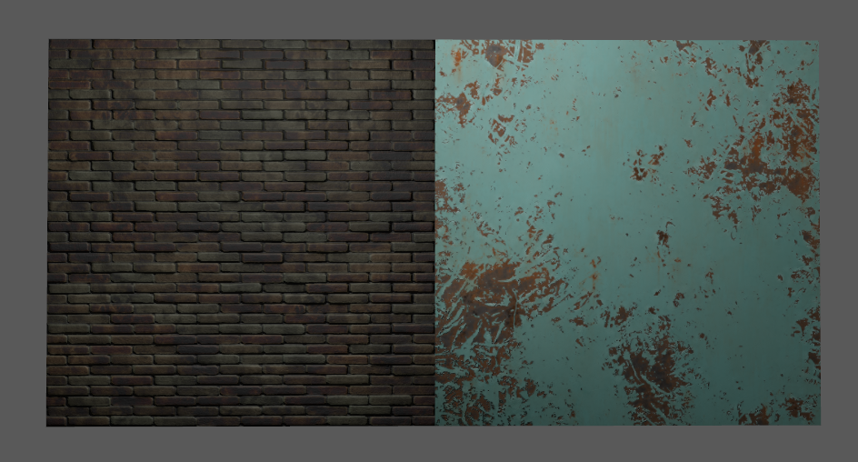
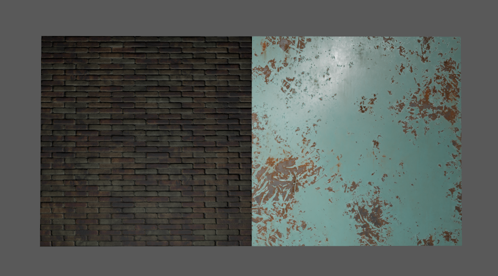
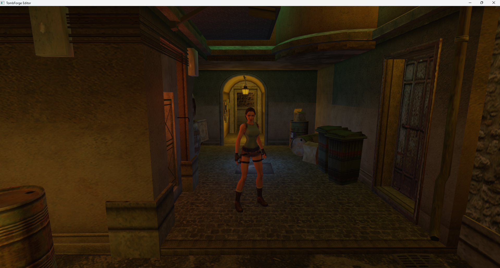
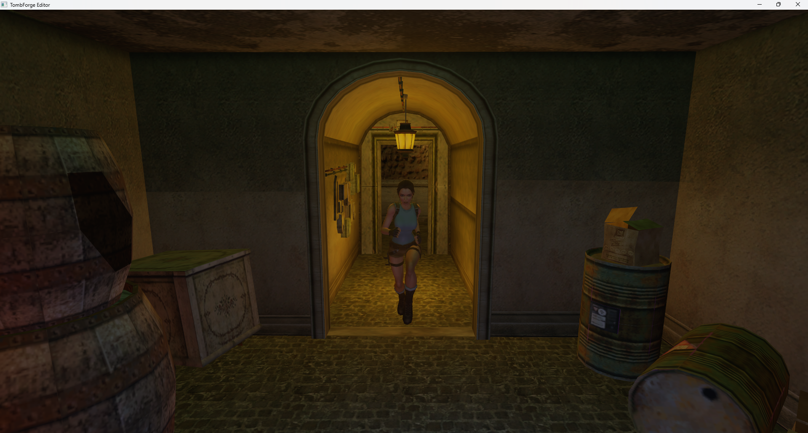
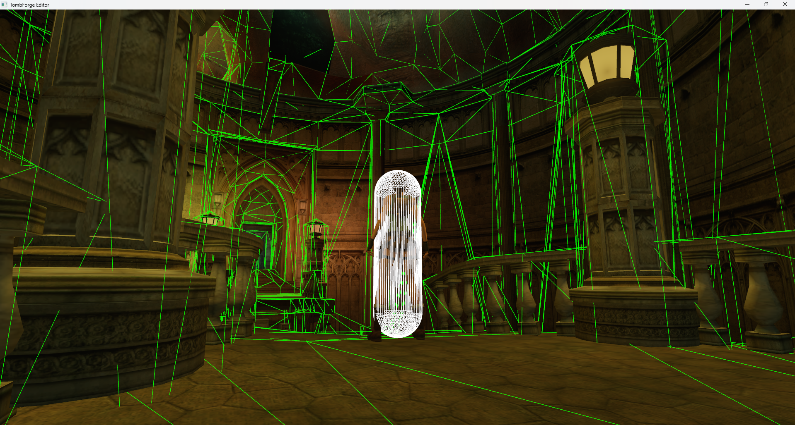
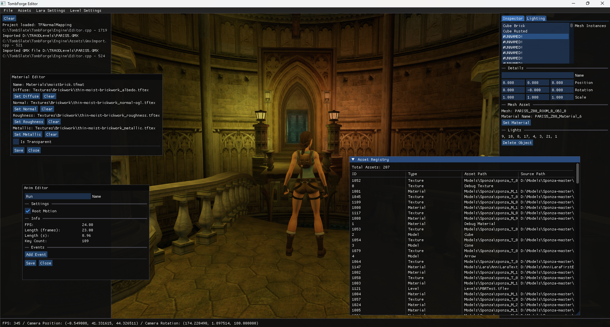

# TombForge Game Engine

This is a work-in-progress game engine intended to develop and play modern Tomb Raider levels.

It features its own 3D animation and rendering systems as well features such as serialization and the integration of the Jolt SDK.

## Physically Based Rendering (PBR)

Using the Cook-Torrance BRDF, the engine is capable of using not only normal maps, but also roughness and metalness maps to create more 
realistic looking graphics. The above images show the same scene with different light positions.

## Skeletal Animation

Currently supporting up to 127 bones, the 3D animation system includes root motion support.

## Physics

The integration of the Jolt SDK means the engine features a powerful physics system.

## Editor

The editor is built into the same codebase as the engine with different editors for different assets. 
The above screenshots shows the editor with various windows including the asset registry.

## Audio

The engine features an audio system that can be used to play sounds during gameplay.

> **Note:** The above screenshots feature levels from older Tomb Raider games. They do not have PBR maps.

# License

See the LICENSE file provided.

# Disclaimer

Anything created with or derived from TombForge must be free-of-charge. See the provided license. 
The creator of TombForge assumes no responsibility or liability for any product(s) or software created or derived from it. 
TombForge is not affiliated with Embracer Group or the Crystal Dynamics group of companies. 
Lara Croft, Tomb Raider, and the Tomb Raider logo are trademarks of the Crystal Dynamics group of companies. All rights reserved.